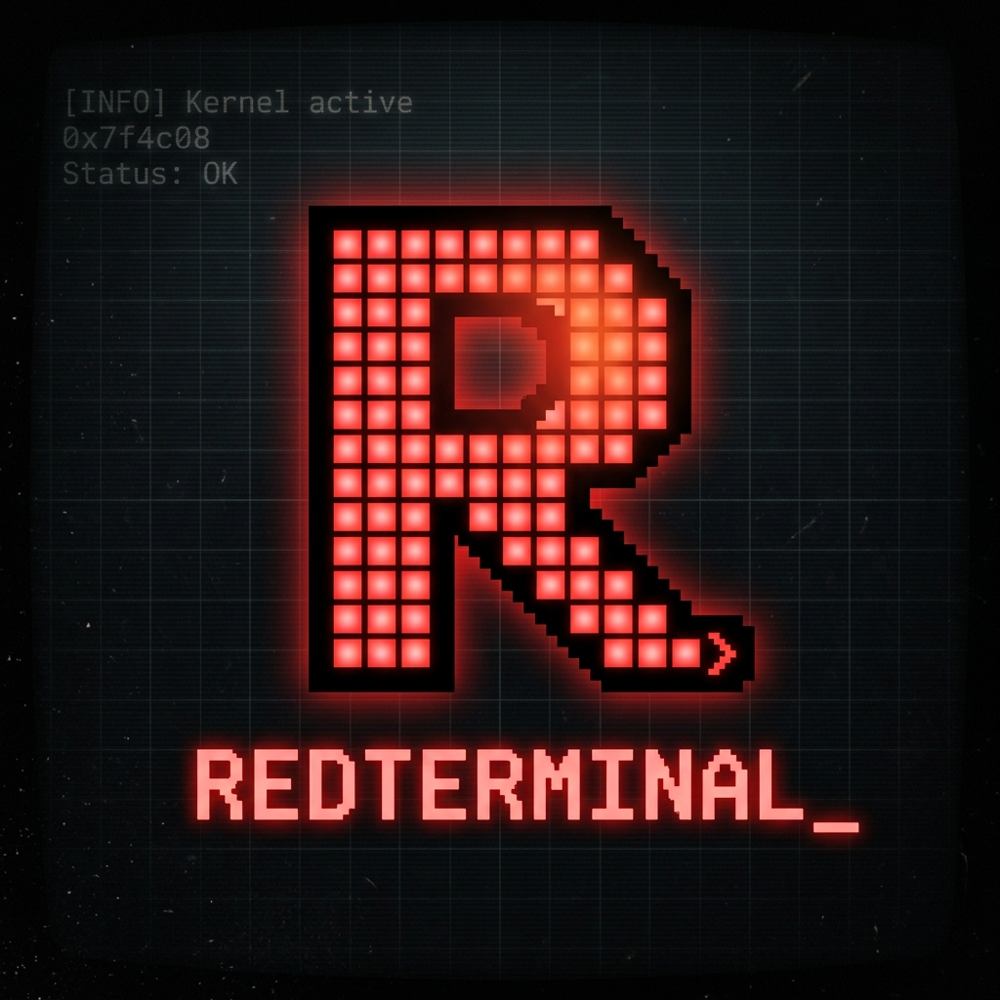
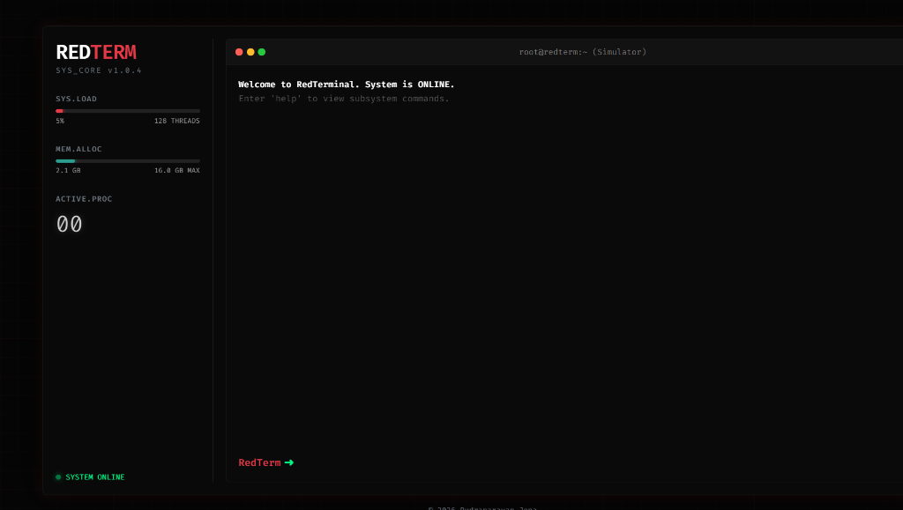
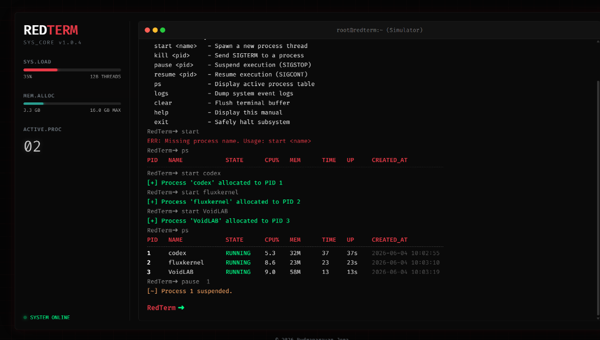

<p align="center">
  
</p>
<h1 align="center">RedTerminal</h1>
<p align="center">
  A lightweight systems-level C project demonstrating operating systems concepts, process lifecycle management, and simulated CPU scheduling.
</p>
<p align="center">
  <a href="https://voxion-labs.github.io/RedTerminal/">Live Web Demo</a>
  |
  <a href="https://github.com/Voxion-Labs/RedTerminal">Repository</a>
</p>

---

## ✨ Overview
RedTerminal is a C-based process simulator and interactive CLI designed to explore fundamental OS concepts. It features strict process state transitions, thread-safe asynchronous logging, background thread scheduling, and includes a stunning Vanilla JS web-based terminal emulator that brings the OS concepts to a modern browser interface.

---

##  What Is RedTerminal?
RedTerminal acts as a playground and educational tool for developers who want to understand the inner workings of an operating system's process manager.

At the technical level, RedTerminal acts as:
- an interactive REPL shell environment
- a background CPU time scheduler simulator using POSIX threads
- a robust Process Control Block (PCB) manager
- a thread-safe asynchronous event logger
- a visually striking web-based terminal emulator for browser deployment

---

##  Problem It Solves
Learning about operating systems often involves massive codebases like the Linux kernel, making it hard to focus on fundamental concepts in isolation:

- real OS kernels are overwhelmingly complex
- theoretical concepts are hard to visualize
- typical student projects lack professional structure or modern interfaces

RedTerminal solves that by giving users a clean, isolated environment to explore:
- how processes transition between RUNNING, STOPPED, and TERMINATED states
- how background schedulers simulate CPU time without blocking user input
- how concurrency is handled with thread-safe mutex locks
- how these backend concepts can be visualized in a modern web dashboard

---

## 🔗 Links
- **[Live Web Demo](https://voxion-labs.github.io/RedTerminal/)**
- **[GitHub Repository](https://github.com/Voxion-Labs/RedTerminal)**
- **[Issues](https://github.com/Voxion-Labs/RedTerminal/issues)**

---

##  Latest Project State
RedTerminal currently ships with:

- a C-based interactive shell with robust command parsing
- commands for `start`, `kill`, `pause`, `resume`, `ps`, and `logs`
- an asynchronous `pthread` based scheduler simulating CPU execution
- strict process lifecycle management up to 256 concurrent processes
- a fully integrated Vanilla JS web demo that mirrors the OS logic visually
- comprehensive test suites for core modules
- complete build automation via `Makefile`

---

## 🌌 Core Highlights
- polished web demo with glassmorphism UI and OS-style boot sequence
- real-time terminal input history and custom typing animations in the browser
- fully decoupled background scheduler in C using POSIX threads
- thread-safe logging infrastructure using mutexes
- interactive CLI interface that handles edge cases and state validation gracefully
- lightweight footprint requiring only `gcc` and `make` to compile locally

---

##  Project Surface
### C Application Experience
- interactive REPL environment built directly on standard I/O
- deterministic process lifecycle handling (RUNNING, STOPPED, TERMINATED)
- automated background logging of all critical system events
- detailed process table (`ps`) outputting active state and CPU time

### Web Demo Experience
- premium boot screen sequence for OS startup simulation
- live updating telemetry sidebar tracking CPU load, Memory, and Uptime
- custom blinking cursor and typing animations mimicking real terminal behavior
- full command history accessible via arrow keys

---

## 🖼️ Demo Gallery
<table>
  <tr>
    <td width="50%" valign="top">
      
      <br />
      <strong>1. System Boot & Initialization</strong>
      <br />
      The web version features a polished glassmorphism UI that boots into a ready state with zero active processes and a clean telemetry sidebar.
    </td>
    <td width="50%" valign="top">
      
      <br />
      <strong>2. Active Process Simulation</strong>
      <br />
      Once processes are spawned, the terminal tracks states in real-time, displaying PID allocations while the telemetry sidebar graphs synthetic CPU and memory load.
    </td>
  </tr>
</table>

---

##  Why RedTerminal
RedTerminal is built around a simple educational promise:
- take complex OS concepts
- distill them into readable C code
- provide an interactive interface to test them
- visualize the outcome beautifully

That promise shapes the module structure, the threading model, the data structures used, and the accompanying web demo layer across the project.

---

## 🛠️ Tech Stack
### Core Systems (Backend)
- C11 Standard
- POSIX Threads (`pthreads`)
- GNU Make

### Web Demo (Frontend)
- HTML5
- CSS3 (Custom Properties, Flexbox, Animations)
- Vanilla JavaScript (ES6+)

---

## 🧱 Project Structure
```text
RedTerminal/
├── Makefile                # Build system configuration
├── README.md               # Project overview and instructions
├── LICENSE                 # MIT License
├── .github/workflows/      # CI/CD pipelines
├── demo/                   # Technical documentation & assets
│   ├── architecture.md     # Module layout and thread model
│   ├── commands.md         # CLI reference guide
│   └── screenshots/        # Demo gallery assets
├── include/                # Public C header files (API contracts)
├── src/                    # C source implementations
├── tests/                  # Automated C test suite
└── docs/                   # Vanilla JS Browser Simulation
    ├── app.js
    ├── index.html
    └── style.css
```

---

## 🏗️ Architecture
### Systems Responsibilities
- **Process Manager**: Handles Process Control Blocks (PCBs) and strict state transitions. Safely manages memory and active limits.
- **Scheduler**: Utilizes POSIX threads to simulate CPU time allocation in the background, fully decoupled from the shell blocking IO.
- **Logger**: Asynchronously writes structured system events to `redterm.log` using mutex locks.
- **Shell**: The primary entry point providing a robust REPL interface.

### Data Flow
1. User enters command via the shell interface.
2. The shell parses arguments and delegates to the Process Manager.
3. The Process Manager updates the global PCB array securely.
4. The background Scheduler thread continuously polls the PCB array, granting CPU time to `RUNNING` processes.
5. All critical state changes invoke the thread-safe Logger to record events.

---

## ✅ Validation Snapshot
The current repo state includes:
- modular C code separated clearly into `src` and `include` headers
- a `tests` directory containing assertion-based tests for `logger`, `process`, and `scheduler`
- automated testing execution available through `make test`
- functional web demo deployable to static hosting

---

## 📦 Key Capabilities
- simulated CPU scheduling and multi-process lifecycle tracking
- robust state validation preventing illegal transitions (e.g., killing an already terminated process)
- fully interactive browser-based simulation matching the C application feature-set
- live telemetry tracking simulated CPU load, memory usage, and uptime
- CI/CD ready structure with GitHub Actions workflows

---

##  Current Scope
RedTerminal is currently positioned as a functional systems simulator and web demo with:
- an interactive C CLI application
- a complete web-based terminal simulator
- background thread simulation
- thread-safe logging infrastructure
- comprehensive documentation on architecture and commands

---

##  Local Setup
### Prerequisites
- A POSIX-compliant environment (Linux / macOS / WSL)
- `gcc` compiler
- `make` utility

### Compile the Application
```bash
make
```

### Run the Application
```bash
./redterm
# OR
make run
```

---

## 🏁 Build Commands
### Start Application
```bash
make run
```

### Run Test Suite
```bash
make test
```

### Clean Build Artifacts
```bash
make clean
```

---

## 🌐 Deployment
### Web Demo Deployment
- Hosted as a static web experience via GitHub Pages
- Public product URL: [https://voxion-labs.github.io/RedTerminal/](https://voxion-labs.github.io/RedTerminal/)

### Deployment profile
- lightweight browser-first frontend located in the `docs/` folder
- no external dependencies or build tools required for the web demo

---

## 📄 License

RedTerminal is protected under the MIT License.

The full license text is available in [LICENSE](LICENSE).

License summary:
- copyright © 2026 Rudranarayan Jena
- permission is granted to use, copy, modify, merge, publish, distribute, sublicense, and/or sell copies of the Software
- provided "as is", without warranty of any kind

---

## 👨‍💻 Author
<p align="center">
  
</p>
<p align="center">
  <strong>Crafted by Rudranarayan Jena</strong>
</p>
<p align="center">
  <strong>Founder @ Voxion Labs</strong>
</p>
<p align="center">
  Focused on building polished systems applications, interactive terminal emulators, and educational software experiences.
</p>
<p align="center">
  <a href="https://github.com/liambrooks-lab">GitHub: liambrooks-lab</a>
</p>

---
